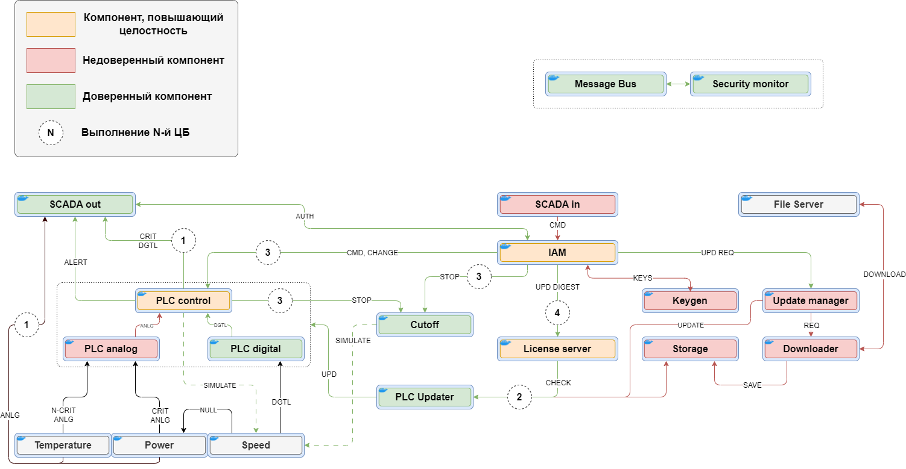
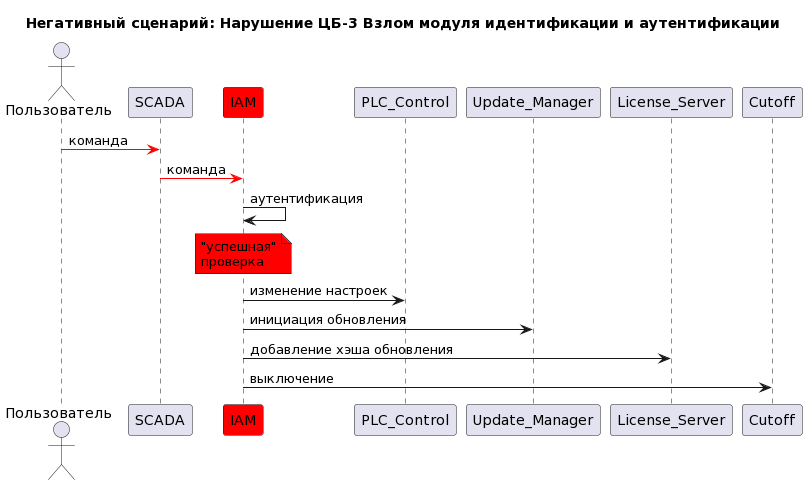
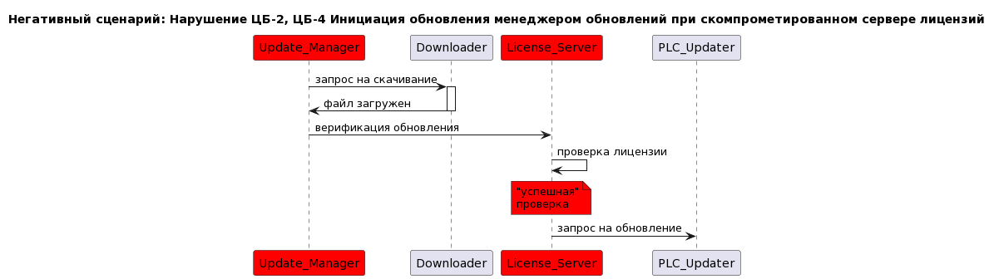

# Отчёт о выполнении задачи "ПЛК"

- [Отчёт о выполнении задачи "ПЛК"](#отчёт-о-выполнении-задачи-плк)
  - [Постановка задачи](#постановка-задачи)
  - [Известные ограничения и вводные условия](#известные-ограничения-и-вводные-условия)
    - [Цели и Предположения Безопасности (ЦПБ)](#цели-и-предположения-безопасности-цпб)
  - [Архитектура системы](#архитектура-системы)
    - [Диаграмма потоков данных (DFD)](#диаграмма-потоков-данных-dfd)
    - [Компоненты](#компоненты)
    - [Операции](#операции)
    - [Алгоритм работы решения](#алгоритм-работы-решения)
    - [Описание Сценариев (последовательности выполнения операций), при которых ЦБ нарушаются](#описание-сценариев-последовательности-выполнения-операций-при-которых-цб-нарушаются)
    - [Политика архитектуры](#политика-архитектуры)
    - [Политики безопасности](#политики-безопасности)
  - [Запуск приложения и тестов](#запуск-приложения-и-тестов)
    - [Запуск приложения](#запуск-приложения)
    - [Запуск тестов](#запуск-тестов)

## Постановка задачи
ПЛК обеспечивает взаимодействие автоматизированной системы
управления технологическим процессом (АСУ ТП) с конечным
оборудованием.

Контроллер выполняет управление техн. оборудованием по прикладной
программе, написанной инженером-разработчиком.

Прикладная программа (ПП) работает поверх системного ПО. Для обеспечения
необходимой гибкости наладки и реализации технических процессов
ПП может свободно меняться квалифицированным
персоналом без необходимости изменения системного ПО.

## Известные ограничения и вводные условия


### Цели и Предположения Безопасности (ЦПБ)
**Цели безопасности:**
1. АСУ ТП всегда получает целостные критичные данные
2. ПЛК выполняет только аутентичное ПП
3. Конечное оборудование всегда получает аутентичные команды
4. Только авторизованные пользователи имеют доступ к лицензии ПЛК
5. Система гарантирует обработку и доставку сигналов за конечное время


**Предположения безопасности:**
- Физическая защита периметра обеспечена
- Персонал ТЭЦ благонадежен
- Технологическое оборудование исправно
- Уровень устройств ввода-вывода - доверенный
- Оператор имеет только удалённый доступ


## Архитектура системы

### Диаграмма потоков данных (DFD)


### Компоненты

**Доверенные компоненты**
| Название             | Назначение                                  | Комментарий |
|----------------------|---------------------------------------------|-|
| **IAM**              | Модуль идентификации и аутентификации       | |
| **License server**   | Сервер лицензий                             | |
| **Cutoff**           | Модуль аварийного отключения                | |
| **PLC Control**      | Модуль ПЛК для обработки и принятия решений | |
| **PLC digital**      | Входной дискретный модуль ПЛК               | |
| **PLC Updater**      | Сервис обновления ПП ПЛК                    | |
| **SCADA out**        | Модуль вывода информации SCADA              | |
| **Security Monitor** | Монитор безопасности                        | |

**Недоверенные компоненты**
| Название           | Назначение                            | Комментарий |
|--------------------|---------------------------------------|-|
| **SCADA in**       | Модуль ввода информации SCADA         | |
| **PLC analog**     | Входной аналоговый модуль ПЛК         | |
| **Keygen**         | Модуль генерации криптоключей для IAM | |
| **Update manager** | Оркестратор обновлений                | |
| **Downloader**     | Загрузчик обновлений                  | |
| **Storage**        | Хранилище обновлений ПП ПЛК           | |

**Обеспечивающие компоненты**
| Название | Назначение | Комментарий |
|-----------------|----------------------------------------|-|
| **File server** | Репозиторий обновлений                 | |
| **Temperature** | Аналоговый датчик температуры          | |
| **Power**       | Аналоговый измеритель мощности турбины | |
| **Speed**       | Датчик скорости вращения               | |

### Операции
| Назначение           | Источник             | Канал | Операция                  | Параметры |
|----------------------|----------------------|:-----:|---------------------------|---|
| **Cutoff**           | **IAM**              | MB    | `hard_stop`               | 🟢 |
| **Cutoff**           | **PLC control**      | MB    | `hard_stop`               | 🟢 |
| **Downloader**       | **Update manager**   | MB    | `request_download`        | `module_name`                   |
| **File Server**      | **Downloader**       | HTTP  | `download_update`         | GET: `filename`                 |
| **IAM**              | **SCADA in**         | MB    | `update_plc_software`     | `user`, `data`, `data.digest`   |
| **IAM**              | **SCADA in**         | MB    | `run_command`             | `user`, `data`, `data.command`  |
| **IAM**              | **SCADA in**         | MB    | `change_settings`         | `user`, `data`, `data.settings` |
| **IAM**              | **SCADA in**         | MB    | `hard_stop`               | `user`, `data`                  |
| **IAM**              | **SCADA out**        | MB    | `check_user`              | `user`, `data`                  |
| **IAM**              | **Keygen**           | MB    | `send_keys`               | |
| **Keygen**           | **IAM**              | MB    | `generate_keys`           | |
| **License Server**   | **IAM**              | MB    | `new_update_digest`       | `digest` |
| **License Server**   | **Security Monitor** | HTTP  | `check_seal`              | `digest` |
| **PLC analog**       | **Power**            | MB    | `push_power_value`        | `power` |
| **PLC analog**       | **Temperature**      | MB    | `push_temperature_value`  | `temperature` |
| **PLC control**      | **IAM**              | MB    | `change_settings`         | `settings` |
| **PLC control**      | **IAM**              | MB    | `run_command`             | `command` |
| **PLC control**      | **PLC analog**       | MB    | `push_temperature_value`  | `temperature` |
| **PLC control**      | **PLC analog**       | MB    | `push_power_value`        | `power` |
| **PLC control**      | **PLC digital**      | MB    | `push_speed_value`        | `speed` |
| **PLC digital**      | **Speed**            | MB    | `push_speed_impulse`      | 🟢 |
| **PLC Updater**      | **Storage**          | MB    | `send_software_update`    | `module_name`, `blob` |
| **PLC Updater**      | **Update manager**   | MB    | `request_software_update` | 🟢 |
| **SCADA in**         | *users*              | HTTP  | `update_plc_software`     | 🟢 |
| **SCADA in**         | *users*              | HTTP  | `run_command`             | 🟢 |
| **SCADA in**         | *users*              | HTTP  | `change_settings`         | 🟢 |
| **SCADA in**         | *users*              | HTTP  | `hard_stop`               | 🟢 |
| **SCADA out**        | **IAM**              | MB    | `authorize_user`          | `auth`, `auth.authorized` |
| **SCADA out**        | **PLC control**      | MB    | `push_speed_value`        | `speed` |
| **SCADA out**        | **Temperature**      | MB    | `push_temperature_value`  | `temperature` |
| **SCADA out**        | **Power**            | MB    | `push_power_value`        | `power` |
| **SCADA out**        | **PLC control**      | MB    | `send_alert`              | `description` |
| **SCADA out**        | *users*              | HTTP  | `subscribe`               | `user`, `data`, `address` |
| **Security Monitor** | *all*                | MB    | *all*                     | `operation` |
| **Speed**            | **PLC control**      | MB    | `change_speed`            | 🟢 |
| **Speed**            | **Cutoff**           | MB    | `shutdown`                | 🟢 |
| **Storage**          | **PLC Updater**      | MB    | `get_software_update`     | 🟢 |
| **Storage**          | **Downloader**       | MB    | `save_file`               | 🟢 |
| **Update manager**   | **IAM**              | MB    | `launch_software_update`  | `module_name` |
| **Update manager**   | **Downloader**       | MB    | `report_downloaded`       | 🟢 |

### Алгоритм работы решения

### Описание Сценариев (последовательности выполнения операций), при которых ЦБ нарушаются

Таблица возможных нарушений ЦБ, в зависимости от скомпрометированного сервиса

| Сервис | ЦБ-1 | ЦБ-2 | ЦБ-3 | ЦБ-4 | ЦБ-5 | 
|------|:---:|:---:|:---:|:---:|:---:|
| **IAM** | 🟢 | 🔴 | 🔴 | 🔴 | 🔴 |
| **PLC Control** | 🔴 | 🔴 | 🔴 | 🟢 | 🔴 |
| **License server** | 🟢/🔴 | 🔴 | 🟢/🔴 | 🔴 | 🟢/🔴 |
| **PLC Updater** | 🟢/🔴 | 🔴 | 🟢/🔴 | 🟢/🔴 | 🟢/🔴 |
| **Cutoff** | 🟢 | 🟢 | 🔴 | 🟢 | 🔴 |
| **PLC digital** | 🔴 | 🟢 | 🟢 | 🟢 | 🟢 |
| **SCADA out** | 🔴 | 🟢 | 🟢 | 🟢 | 🟢 |

Негативные сценарии

| Номер сценария | Описание |
|--|-----|
NS-1 | Взлом модуля идентификации и аутентификации
NS-2 | Инициация обновления менеджером обновлений при скомпрометированном сервере лицензий
NS-3 | Компрометация модуля ПЛК для обработки и принятия решений

**NS-1: Взлом модуля идентификации и аутентификации**



**NS-2: Инициация обновления менеджером обновлений при скомпрометированном сервере лицензий**



**NS-3: Компрометация модуля ПЛК для обработки и принятия решений**


### Политика архитектуры

см. [Диаграмма потоков данных (DFD)](#диаграмма-потоков-данных-dfd)

Выполнение ЦБ-5 обеспечивается:
| Команда                        | Назначение                             | Комментарий |
|--------------------------------|----------------------------------------|-------------|
| Отключение оборудования        | **Cutoff**                             | Запрос от **IAM** к **Cutoff** выполняется за O(l) |
| Обновление, изменение настроек | **PLC control**, **License Server**    | Операции отправки данных к **PLC control** и **License Server** выполняются за O(l), обработка в **PLC control** имеет только одно ветвление, что также не оказывает существенного влияния на время выполнения операции |

### Политики безопасности 


```python {lineNo:true}
# default deny
authorized = False

policies = {
    { 'dst': 'cutoff',         'src': 'iam',            'operation': 'hard_stop'},
    { 'dst': 'cutoff',         'src': 'iam',            'operation': 'hard_stop'},
    { 'dst': 'downloader',     'src': 'update_manager', 'operation': 'request_download'},
    { 'dst': 'iam',            'src': 'scada_in',       'operation': 'update_plc_software'},
    { 'dst': 'iam',            'src': 'scada_in',       'operation': 'run_command'},
    { 'dst': 'iam',            'src': 'scada_in',       'operation': 'change_settings'},
    { 'dst': 'iam',            'src': 'scada_in',       'operation': 'hard_stop'},
    { 'dst': 'iam',            'src': 'scada_out',      'operation': 'check_user'},
    { 'dst': 'iam',            'src': 'keygen',         'operation': 'send_keys'},
    { 'dst': 'keygen',         'src': 'iam',            'operation': 'generate_keys'},
    { 'dst': 'license_server', 'src': 'iam',            'operation': 'new_update_digest'},
    { 'dst': 'plc_analog',     'src': 'temperature',    'operation': 'push_temperature_value'},
    { 'dst': 'plc_analog',     'src': 'power',          'operation': 'push_power_value'},
    { 'dst': 'plc_control',    'src': 'iam',            'operation': 'run_command'},
    { 'dst': 'plc_control',    'src': 'iam',            'operation': 'change_settings'},
    { 'dst': 'plc_control',    'src': 'plc_digital',    'operation': 'push_speed_value'},
    { 'dst': 'plc_control',    'src': 'plc_analog',     'operation': 'push_temperature_value'},
    { 'dst': 'plc_control',    'src': 'plc_analog',     'operation': 'push_power_value'},
    { 'dst': 'plc_digital',    'src': 'speed',          'operation': 'push_speed_impulse'},
    { 'dst': 'plc_updater',    'src': 'storage',        'operation': 'send_software_update'},
    { 'dst': 'plc_updater',    'src': 'update_manager', 'operation': 'request_software_update'},
    { 'dst': 'scada_out',      'src': 'iam',            'operation': 'authorize_user'},
    { 'dst': 'scada_out',      'src': 'plc_control',    'operation': 'push_speed_value'},
    { 'dst': 'scada_out',      'src': 'plc_control',    'operation': 'send_alert'},
    { 'dst': 'scada_out',      'src': 'temperature',    'operation': 'push_temperature_value'},
    { 'dst': 'scada_out',      'src': 'power',          'operation': 'push_power_value'},
    { 'dst': 'speed',          'src': 'plc_control',    'operation': 'change_speed'},
    { 'dst': 'speed',          'src': 'cutoff',         'operation': 'change_speed'},
    { 'dst': 'storage',        'src': 'plc_updater',    'operation': 'get_software_update'},
    { 'dst': 'storage',        'src': 'downloader',     'operation': 'save_file'},
    { 'dst': 'update_manager', 'src': 'iam',            'operation': 'launch_software_update'},
    { 'dst': 'update_manager', 'src': 'downloader',     'operation': 'report_downloaded'}
}

if {'dst': dst, 'src': src, 'operation': operation} in policies:
    authorized = True
    if operation == "send_software_update" and check_payload_seal(details['blob']) is False:
        authorized = False

return authorized
```

## Запуск приложения и тестов

### Запуск приложения

Запуск примера: открыть окно терминала в Visual Studio code, в папке с исходным кодом выполнить 

**make run**
или **docker-compose up -d --build**

### Запуск тестов

_Предполагается, что в ходе подготовки рабочего места все системные пакеты были установлены._

**make test**

